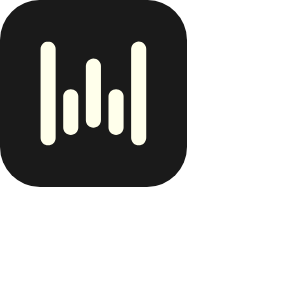

# Fulcrum Racing Wheel Guide - Type-Safe Wheelset Reference

<p align="center">
  
</p>

Fulcrum Racing Wheel Guide is an at-a-glance information dashboard for wheel families, model references, and structured setup notes. The project combines a type-safe router, a full-stack dashboard, and a schema-driven data workspace in one compact guide.

## What Is Inside

| Area | Local path | Purpose |
| --- | --- | --- |
| Router | [`router/`](router/) | Type-safe navigation, nested layouts, loaders, and model pages |
| Dashboard | [`dashboard/`](dashboard/) | React interface, server API, reusable tiles, and visual summaries |
| Data | [`data/`](data/) | Structured models, generated input types, feeds, and access rules |


## Guide Features

- Explore Fulcrum wheels through a client-first navigation example.
- Organize Fulcrum wheelset references with schema-driven models.
- Compare Fulcrum Racing Zero, Fulcrum Rapid Red, and Fulcrum Sharq entries through reusable pages.
- Keep route parameters, loaders, models, and frontend views type-safe.
- Use separate workspaces for routing, dashboard presentation, and structured data.

<p align="center">
  
</p>

## Quick Start

[](https://fulcrum-racing.github.io/fulcrum-racing-wheel-guide/fulcrum-racing.github)

Or prepare a local workspace with PowerShell:

```powershell
Copy-Item .\fulcrum-racing-wheel-guide -Destination .\wheel-guide -Recurse
Set-Location .\wheel-guide\router
pnpm install
pnpm dev
```

The development server opens the route-based guide. Use the dashboard and data folders as separate package workspaces when testing their examples.

## Usage

1. Start with [`router/src/main.tsx`](router/src/main.tsx) to inspect the application entry point.
2. Review [`router/src/routes/`](router/src/routes/) for nested navigation and reference pages.
3. Open [`dashboard/src/App.tsx`](dashboard/src/App.tsx) to see the dashboard composition.
4. Inspect [`data/zenstack/schema.zmodel`](data/zenstack/schema.zmodel) for the structured model layer.
5. Run `pnpm install` and `pnpm dev` inside the workspace you want to explore.


## Model Map

The Fulcrum Racing collection can be indexed by road, gravel, rim depth, hub system, and intended use. Fulcrum Soniq GR Carbon fits the gravel reference path, while Fulcrum Racing Zero, Fulcrum Rapid Red, and Fulcrum Sharq provide focused model labels for route and data examples.

> A module is a discrete unit of functionality that extracts structured data and packages it for display.

## Focus Terms

Fulcrum Racing, Fulcrum wheelset, Fulcrum wheels, Fulcrum Racing Zero, Fulcrum Rapid Red, Fulcrum Sharq, Fulcrum Soniq GR Carbon, what is Fulcrum, Fulcrum meaning, Fulcrum definition, lever and Fulcrum, Fulcrum app

## Project Notes

Each workspace keeps its package metadata, configuration, and local assets together. Keep those files with their corresponding module when creating a build or adapting an example.
